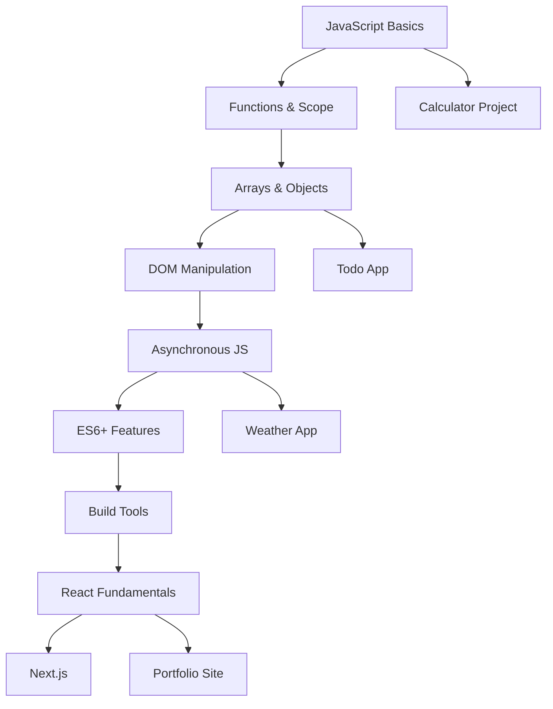

# JavaScript Curriculum Documentation

## Pedagogical Approach for C++/Java Developers

### Overview
This curriculum is specifically designed for experienced developers transitioning from statically-typed languages (C++/Java) to JavaScript. The approach emphasizes:
- **Comparative Learning**: Explicitly comparing JavaScript concepts to C++/Java equivalents
- **Type-First Thinking**: Addressing type coercion and dynamic typing concerns upfront
- **Practical Application**: Every concept is immediately applied in interactive exercises
- **Progressive Complexity**: Starting with familiar concepts, gradually introducing JavaScript-specific features

## Learning Philosophy

### 1. Bridge the Mental Model Gap
C++/Java developers have strong mental models about:
- **Type Safety**: Variables have fixed types
- **Compilation**: Errors caught before runtime
- **Memory Management**: Explicit or managed through garbage collection
- **Class-Based OOP**: Inheritance hierarchies

JavaScript challenges these models:
- **Dynamic Typing**: Types are fluid and change
- **Runtime Interpretation**: Many errors only surface during execution
- **Automatic Memory Management**: Different from both manual (C++) and JVM (Java)
- **Prototypal Inheritance**: Objects inherit from objects, not classes

### 2. Progressive Disclosure Pattern
Each module follows a structured learning path:
```
1. Familiar Ground → Start with concepts they know
2. Comparison → Show how JavaScript differs
3. Hands-On Practice → Interactive coding exercises
4. Common Pitfalls → Address typical mistakes
5. Real Project → Apply in practical context
```

## Module Structure

### Module 1: JavaScript Basics (Completed)
**Duration**: 45 minutes
**XP**: 100 points

#### Learning Objectives
- Understand JavaScript's dynamic typing vs static typing
- Master variable declarations (const, let, avoiding var)
- Work with primitive types and understand coercion
- Apply operators with awareness of type conversion

#### Key Pedagogical Elements
1. **Type Comparison Table**: Direct mapping of C++/Java types to JavaScript
2. **Coercion Exercises**: Predict-the-output challenges
3. **Calculator Project**: Practical application requiring type management

#### Teaching Notes
- **Start with const**: Emphasize immutability first (familiar from C++ const)
- **Type Coercion as Feature/Bug**: Explain both benefits and dangers
- **Practical Examples**: Use real-world scenarios (form input is always string)

#### Common Student Challenges
1. **Using == instead of ===**: Explain coercion vs strict equality
2. **String concatenation with +**: The only operator that prefers strings
3. **Truthy/Falsy confusion**: Especially [] and {} being truthy
4. **Hoisting with var**: Why we avoid it in modern JavaScript

### Module 2: Functions & Scope
**Duration**: 60 minutes
**XP**: 150 points

#### Learning Objectives
- Compare function declarations to C++/Java methods
- Understand first-class functions (functions as values)
- Master arrow functions and lexical this binding
- Grasp closure concept (similar to Java inner classes)

#### Pedagogical Approach
```javascript
// Start with familiar syntax
function add(a, b) {  // Like C++/Java
  return a + b;
}

// Introduce functions as values
const add = function(a, b) {  // Function expression
  return a + b;
};

// Modern arrow syntax
const add = (a, b) => a + b;  // Concise, lexical this

// Explain closures through factory pattern
function createCounter() {
  let count = 0;  // Private variable (like private in Java)
  return {
    increment: () => ++count,
    decrement: () => --count,
    getValue: () => count
  };
}
```

### Module 3: Arrays & Objects
**Duration**: 75 minutes
**XP**: 200 points

#### Learning Objectives
- Arrays as dynamic, heterogeneous collections
- Objects as hashmaps/dictionaries
- Destructuring for cleaner code
- Spread operator for immutable operations

#### C++/Java Comparison Points
- **Arrays**: Not fixed size like C++ arrays or Java arrays
- **Objects**: Like Java HashMaps but with method support
- **Pass by Reference**: Objects/arrays are references (like Java objects)
- **No Pointers**: Reference behavior without pointer syntax

### Module 4: Asynchronous JavaScript
**Duration**: 90 minutes
**XP**: 250 points

#### Learning Objectives
- Event loop vs thread-based concurrency
- Callbacks → Promises → Async/Await evolution
- Error handling in async code
- Practical API interactions

#### Teaching Strategy
1. **Start with Synchronous**: Show blocking behavior
2. **Introduce Problem**: UI freezing, poor UX
3. **Callbacks**: The original solution (callback hell)
4. **Promises**: Better error handling and chaining
5. **Async/Await**: Synchronous-looking async code

### Module 5: Modern ES6+ Features
**Duration**: 60 minutes
**XP**: 200 points

#### Focus Areas
- Template literals (string interpolation)
- Classes (syntactic sugar over prototypes)
- Modules (import/export)
- Optional chaining and nullish coalescing

## Assessment Strategy

### Formative Assessment
- **Interactive Exercises**: Immediate feedback on code
- **Predict-the-Output**: Tests understanding of concepts
- **Type Coercion Detective**: Specific to JavaScript quirks

### Summative Assessment
- **Module Projects**: Apply multiple concepts
- **Calculator Project**: Variables, types, functions
- **Todo App**: Arrays, objects, DOM manipulation
- **Weather App**: Async, APIs, error handling

## Progressive Skill Building

### Week 1-2: Foundation
- JavaScript Basics ✅
- Functions & Scope
- Practice with simple algorithms

### Week 3-4: Data Structures
- Arrays & Objects
- Working with JSON
- Local storage projects

### Week 5-6: Asynchronous Programming
- Understanding the event loop
- Promises and async/await
- API integration projects

### Week 7-8: Modern JavaScript
- ES6+ features
- Build tools introduction
- Prepare for React

## Scaffolding Techniques

### 1. Starter Code Structure
```javascript
/**
 * TODO: Implement this function
 * 
 * Requirements:
 * - [Specific requirement 1]
 * - [Specific requirement 2]
 * 
 * Hints:
 * - Consider using [technique]
 * - Watch out for [common pitfall]
 * 
 * For C++/Java developers:
 * - This is similar to [familiar concept]
 * - But differs in [key way]
 */
function yourImplementation() {
  // Your code here
}
```

### 2. Progressive Hints System
- **Hint 1**: Conceptual guidance
- **Hint 2**: Specific approach
- **Hint 3**: Partial code example
- **Solution**: Full implementation with explanation

### 3. Error Messages as Teaching Tools
```javascript
// Educational error handling
try {
  // Student code
} catch (error) {
  console.error(`
    Error: ${error.message}
    
    This often happens when:
    - You forget to convert string to number
    - You're accessing undefined properties
    
    Try: Use Number() or check if property exists
  `);
}
```

## Common Pitfalls & Solutions

### For C++/Java Developers

#### Pitfall 1: Expecting Block Scope with var
```javascript
// C++/Java mindset
for (var i = 0; i < 5; i++) {
  // i is function-scoped, not block-scoped!
}
console.log(i); // 5 (still accessible!)

// Solution: Use let
for (let i = 0; i < 5; i++) {
  // i is block-scoped
}
// console.log(i); // Error: i is not defined
```

#### Pitfall 2: Assuming Type Safety
```javascript
// This runs without error!
let value = 42;
value = "forty-two";  // Type changed at runtime

// Solution: Use TypeScript or careful validation
```

#### Pitfall 3: Method Binding Issues
```javascript
class Counter {
  constructor() {
    this.count = 0;
  }
  
  increment() {
    this.count++;
  }
}

const counter = new Counter();
const inc = counter.increment;
inc(); // Error: 'this' is undefined!

// Solution: Arrow functions or explicit binding
class Counter {
  count = 0;
  increment = () => {  // Arrow function binds 'this'
    this.count++;
  }
}
```

## Engagement Strategies

### 1. Gamification Elements
- **XP System**: Points for completion
- **Achievements**: "Type Master", "Async Ninja"
- **Progress Tracking**: Visual progress bars
- **Leaderboards**: Optional competitive element

### 2. Real-World Projects
- **Calculator**: Apply basic concepts
- **Todo App**: Data management
- **Weather Dashboard**: API integration
- **Portfolio Site**: Complete application

### 3. Interactive Features
- **Live Code Execution**: Sandpack integration
- **Instant Feedback**: See results immediately
- **Collaborative Challenges**: Pair programming exercises
- **Code Reviews**: Learn from others' solutions

## Success Metrics

### Learning Outcomes
- **Concept Understanding**: 80% quiz pass rate
- **Practical Application**: Complete 3+ projects
- **Error Reduction**: Fewer type-related bugs over time
- **Confidence**: Self-reported comfort with JavaScript

### Engagement Metrics
- **Completion Rate**: 70% finish all modules
- **Time on Task**: Average 45-60 minutes per module
- **Return Rate**: 80% continue to next module
- **Help Usage**: Gradual decrease in hint usage

## Continuous Improvement

### Feedback Loops
1. **End-of-Module Surveys**: What was clear/confusing?
2. **Error Analysis**: Common mistakes inform content updates
3. **Time Tracking**: Identify modules that take too long
4. **Success Patterns**: What helps students succeed?

### Content Updates
- Add new ES features as they stabilize
- Update examples based on student feedback
- Create additional practice exercises for difficult concepts
- Develop more real-world projects

## Instructor Notes

### Module Delivery Tips
1. **Always start with familiar concepts** - Build confidence
2. **Use visual aids** - Diagrams for scope, event loop
3. **Live coding** - Make mistakes and debug them
4. **Encourage experimentation** - Break things to learn
5. **Celebrate small wins** - Every concept mastered matters

### Differentiation Strategies
- **Advanced Path**: Additional challenges for quick learners
- **Support Path**: Extra exercises with more scaffolding
- **Visual Learners**: Diagrams and animations
- **Kinesthetic Learners**: Interactive coding exercises

## Resources & References

### Recommended Reading
- "JavaScript: The Good Parts" by Douglas Crockford
- "You Don't Know JS" series by Kyle Simpson
- MDN Web Docs for reference
- JavaScript.info for detailed explanations

### Tools & Platforms
- **Sandpack**: In-browser code execution
- **CodePen**: Quick experimentation
- **Chrome DevTools**: Debugging practice
- **Node.js**: Server-side JavaScript

---

## Appendix: Complete Learning Path



---

*This curriculum is designed to transform competent C++/Java developers into confident JavaScript developers through careful scaffolding, practical application, and respect for their existing knowledge.*